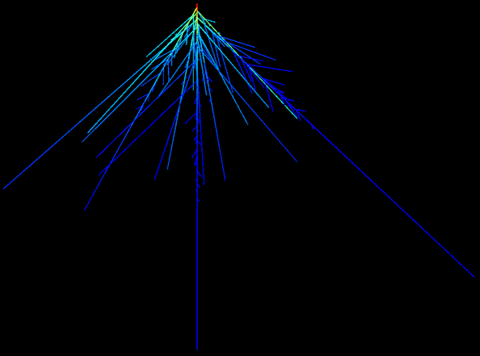
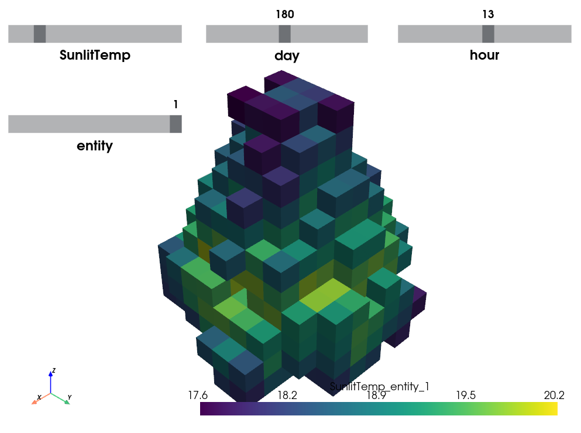

================
Plant Biophysics
================

Hydroshoot
==========

.. image:: https://readthedocs.org/projects/hydroshoot/badge/?version=latest
   :target: https://hydroshoot.readthedocs.io/en/latest/?badge=latest

**Hydroshoot model for 3D hydraulic architecture simulation**

.. image:: ./images/hydroshoot_grapevine.png
 :width: 200px
 :target: https://hydroshoot.readthedocs.io/en/latest/
 :align: left

HydroShoot is a functional-structural plant modelling package taking into account hydraulic architecture and leaves energy budget and gas exchange.

**Authors** : Rami Albasha, Christian Fournier, Christophe Pradal

**Institutes** : INRA, Cirad

**Citation** : Albasha et al., 2019, https://doi.org/10.1093/insilicoplants/diz007

**Source Code** : `Github <https://github.com/openalea/hydroshoot>`_

|

HydroRoot
==========

.. image:: https://readthedocs.org/projects/hydroroot/badge/?version=latest
   :target: https://hydroroot.readthedocs.io/en/latest/?badge=latest

**openalea.hydroroot is a hydraulic root architecture modelling and a root architecture system generator package.**

The OpenAlea.HydroRoot package contains a pure hydraulic solver and a water and solute transport solver.

**Authors** : Christophe Pradal, Yann Boursiac, Mikael Lucas, Fabrice Bauget, Christophe Godin, Christophe Maurel

**Institutes** : CIRAD, INRAE, inria, CNRS

**Citation** : Boursiac et al., 2022, https://doi.org/10.1093/plphys/kiac281, Bauget et al., 2023, https://doi.org/10.1093/jxb/erac471

**Source Code** : `Github <https://github.com/openalea/hydroroot>`_

|

Openalea RATP
=============

.. image:: https://readthedocs.org/projects/pyratp/badge/?version=latest
   :target: https://pyratp.readthedocs.io/en/latest/?badge=latest

**RATP: Radiation Absorption, Transpiration and Photosynthesis**

The model RATP (aka OpenAlea.RATP) was designed to simulate the spatial distribution of radiation and leaf-gas exchanges within vegetation canopies as a function of canopy structure, canopy microclimate and physical and physiological leaf properties.

**Authors** : Herve Sinoquet, Marc Saudreau, Jerome Ngao, Boris Adam, Christophe Pradal, Christian Fournier

**Institutes** : CIRAD, INRAE, inria, CNRS

**Citation** : Sinoquet et al., 2001, https://doi.org/10.1046/j.1365-3040.2001.00694.x

**Source Code** : `Github <https://github.com/openalea/pyratp>`_
