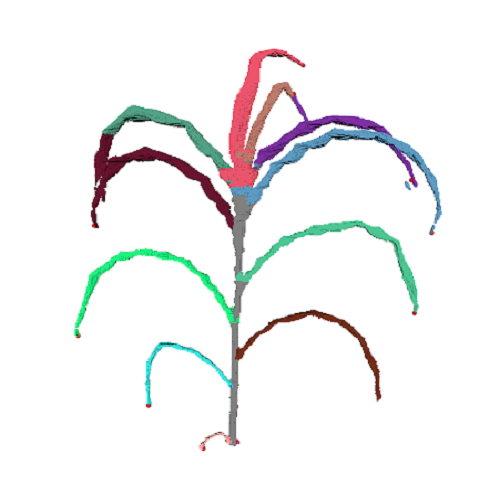
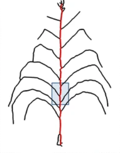

========
Packages
========

.. include:: tools.rst

Modelling with OpenAlea
=======================

MTG
---

.. image:: https://readthedocs.org/projects/mtg/badge/?version=latest
 :target: http://mtg.readthedocs.io/en/latest/

**Multiscale Tree Graph datastructure and interfaces**

.. image:: ./images/mtg_plantframe.png
 :width: 200px
 :target: http://mtg.readthedocs.io/en/latest/
 :align: left

MTG package aims to define :

  * A share data structure for plant architecture representation.
  * Read and write MTG files.
  * Export to various graph format.
  * Several algorithms for MTG.       

**Authors** : Christophe Pradal, Christophe Godin

**Institutes** : Cirad, Inria

**Source Code** : `Github <https://github.com/openalea/mtg>`_

L-Py
----
     
.. image:: https://readthedocs.org/projects/lpy/badge/?version=latest
 :target: http://lpy.readthedocs.io/en/latest/

**Plant simulation using Lindenmayer Systems with Python**

.. image:: ./images/lpy_lpymagic.png
 :width: 200px
 :target: http://lpy.readthedocs.io/en/latest/
 :align: left

L-systems were conceived as a mathematical framework for modeling growth of plants. 
L-Py is a simulation software that mixes L-systems construction with the Python high-level modeling language. 

**Authors** : Frédéric Boudon, Christophe Pradal, Thomas Cokelaer, Przemyslaw Prusinkiewicz, Christophe Godin

**Institutes** : Cirad, Inria, U. Calgary

**Citation** : Boudon et al., 2012, https://doi.org/10.3389/fpls.2012.00076

**Source Code** : `Github <https://github.com/openalea/lpy>`_

PlantGL
-------

.. image:: https://readthedocs.org/projects/plantgl-cpl/badge/?version=latest
  :target: https://plantgl-cpl.readthedocs.io/en/latest/?badge=latest

**An open-source graphic toolkit for the creation, simulation and analysis of 3D virtual plants**

.. image:: ./images/plantgl.png
 :width: 200px
 :target: https://plantgl-cpl.readthedocs.io/en/latest/
 :align: left

**Authors**: Frédéric Boudon, Christophe Pradal, Christophe Nouguier, Jérôme Chopard, Christophe Godin

**Institutes** : Cirad, Inria

**Citation** : Pradal, Boudon et al., 2009, https://doi.org/10.1016/j.gmod.2008.10.001

**Source Code** : `Github <https://github.com/openalea/plantgl>`_

OpenAlea Framework
------------------

.. image:: https://readthedocs.org/projects/openalea-core/badge/?version=latest
    :alt: Documentation status
    :target: https://openalea-core.readthedocs.io/en/latest/?badge=latest

**OpenAlea Framework is able to discover and manage packages and logical components, build and evaluate dataflows and Generate final applications**

.. image:: ./images/openalea_web.png
 :width: 200px
 :target: https://openalea-core.readthedocs.io/en/latest/
 :align: left

**Authors** : Christophe Pradal, Samuel Dufour-Kowalski, Frédéric Boudon, Christian Fournier, Christophe Godin

**Institutes** : Cirad, Inria, INRA

**Citation** : Pradal et al., 2008, https://doi.org/10.1071/FP08084

**Source Code** : `Github <https://github.com/openalea/core>`_

VisuAlea
--------

**An application that allows to use OpenAlea packages and to build dataflow graphically**

.. image:: ./images/visualea_workflow.png
 :width: 200px
 :target: https://github.com/openalea/visualea
 :align: left

**Authors** : Christophe Pradal, Samuel  

**Institutes** : Cirad, Inria

**Source Code** : `Github <https://github.com/openalea/visualea>`_

|
|
|

Plant Models
============

WeberPenn
---------

**An extension of the Weber & Penn model for OpenAlea**

.. image:: ./images/weberpenn_treegraph.png
 :width: 200px
 :target: https://github.com/openalea/weberpenn
 :align: left

**Authors** : Christophe Pradal

**Institutes** : Cirad

**Original Article** : http://citeseerx.ist.psu.edu/viewdoc/summary?doi=10.1.1.380.2046

**Source Code** : `Github <https://github.com/openalea/weberpenn>`_

|

Plant Biophysics
================

Hydroshoot
----------

.. image:: https://readthedocs.org/projects/hydroshoot/badge/?version=latest
   :target: https://hydroshoot.readthedocs.io/en/latest/?badge=latest

**Hydroshoot model for 3D hydraulic architecture simulation**

.. image:: ./images/hydroshoot_grapevine.png
 :width: 200px
 :target: https://hydroshoot.readthedocs.io/en/latest/
 :align: left

HydroShoot is a functional-structural plant modelling package taking into account hydraulic architecture and leaves energy budget and gas exchange.

**Authors** : Rami Albasha, Christian Fournier, Christophe Pradal

**Institutes** : INRA, Cirad 

**Citation** : Albasha et al., 2019, https://doi.org/10.1093/insilicoplants/diz007

**Source Code** : `Github <https://github.com/openalea/hydroshoot>`_

Phenotyping
===========

Phenomenal
----------

.. image:: https://readthedocs.org/projects/phenomenal/badge/?version=latest
 :target: https://phenomenal.readthedocs.io/en/latest/?badge=latest
 :alt: Documentation Status

.. image:: https://zenodo.org/badge/DOI/10.5281/zenodo.1436634.svg
 :target: https://doi.org/10.5281/zenodo.1436634

**3D reconstruction from high-throughput plant phenotyping images**

Plant high-throughput phenotyping aims at capturing the genetic variability of plant response to environmental factors for thousands of plants, hence identifying heritable traits for genomic selection and predicting the genetic values of allelic combinations in different environments.

**Authors** : Simon Artzet, Christian Fournier, Christophe Pradal, Nicolas Brichet, Jerome Chopard, Michael Mielewczik

**Institutes** : INRA, Cirad

**Source Code** : `Github <https://github.com/openalea/phenomenal/>`_

EarTrack
--------

.. image:: https://readthedocs.org/projects/eartrack/badge/?version=latest
 :target: http://eartrack.readthedocs.io/en/latest/?badge=latest
 :alt: Documentation Status

.. image:: https://zenodo.org/badge/DOI/10.5281/zenodo.1002155.svg
 :target: https://doi.org/10.5281/zenodo.1002155

**EarTrack is an imaging library to detect and track future position of ears on maize plants**

**Authors** : Nicolas Brichet, Christian Fournier, Simon Artzet, Christophe Pradal, 

**Institutes** : INRA, Cirad 

**Citation** : Brichet et al., 2017, https://doi.org/10.1186/s13007-017-0246-7

**Source Code** : `Github <https://github.com/openalea/eartrack>`_