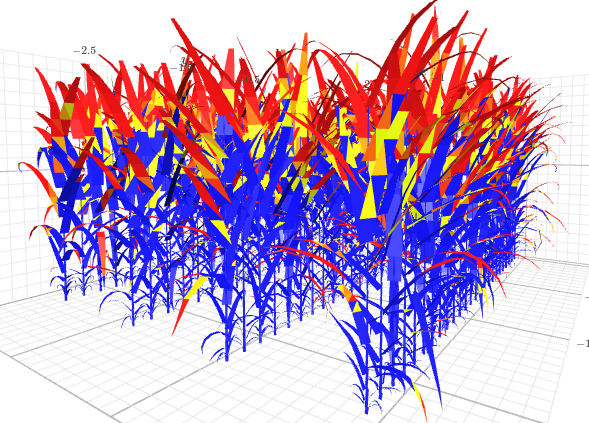
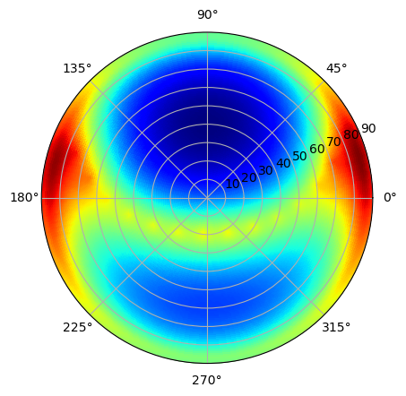

===================
Light and sky model
===================

Caribu
======

.. image:: https://readthedocs.org/projects/caribu/badge/?version=latest
    :alt: Documentation status
    :target: https://caribu.readthedocs.io/en/latest/?badge=latest

**Caribu is a modelling suite for lighting 3D virtual scenes, especially designed for the illumination of virtual plant canopies such as virtual crop fields.**

**Authors** : Christian Fournier, Michael Chelle, Christophe Pradal

**Institutes** :  INRAe

**Citation** : Chelle et al., 1998, https://doi.org/10.1007/s003710050127, Chelle et al., 1998, https://hal.inrae.fr/hal-04945340v1

**Source Code** : `Github <https://github.com/openalea/caribu>`_

|

Astk
====

.. image:: https://readthedocs.org/projects/openalea-astk/badge/?version=latest
    :alt: Documentation status
    :target: https://openalea-astk.readthedocs.io/en/latest/?badge=latest

**Astk allows to calculate sky luminance and sky sources to be used with FSPM light models from weather data.**

**Authors** : Christian Fournier

**Institutes** :  INRAe

**Source Code** : `Github <https://github.com/openalea/astk>`_
