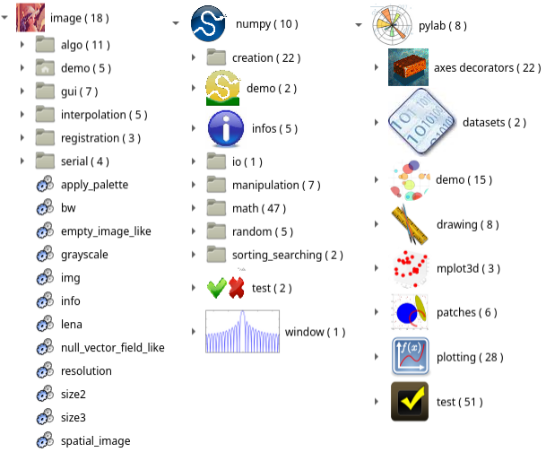
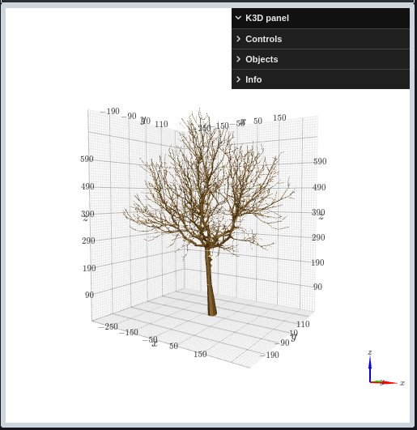
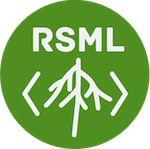

=======================
Modelling with OpenAlea
=======================

MTG
===

.. image:: https://readthedocs.org/projects/mtg/badge/?version=latest
 :target: http://mtg.readthedocs.io/en/latest/

**Multiscale Tree Graph datastructure and interfaces**

.. image:: ./images/mtg_plantframe.png
 :width: 200px
 :target: http://mtg.readthedocs.io/en/latest/
 :align: left

MTG package aims to define :
  * A share data structure for plant architecture representation.
  * Read and write MTG files.
  * Export to various graph format.
  * Several algorithms for MTG.

**Authors** : Christophe Pradal, Christophe Godin

**Institutes** : Cirad, Inria

**Source Code** : `Github <https://github.com/openalea/mtg>`_

L-Py
====

.. image:: https://readthedocs.org/projects/lpy/badge/?version=latest
 :target: http://lpy.readthedocs.io/en/latest/

**Plant simulation using Lindenmayer Systems with Python**

.. image:: ./images/lpy_lpymagic.png
 :width: 200px
 :target: http://lpy.readthedocs.io/en/latest/
 :align: left

L-systems were conceived as a mathematical framework for modeling growth of plants.
L-Py is a simulation software that mixes L-systems construction with the Python high-level modeling language.

**Authors** : Frédéric Boudon, Christophe Pradal, Thomas Cokelaer, Przemyslaw Prusinkiewicz, Christophe Godin

**Institutes** : Cirad, Inria, U. Calgary

**Citation** : Boudon et al., 2012, https://doi.org/10.3389/fpls.2012.00076

**Source Code** : `Github <https://github.com/openalea/lpy>`_

PlantGL
=======

.. image:: https://readthedocs.org/projects/plantgl/badge/?version=latest
  :target: https://plantgl.readthedocs.io/en/latest/?badge=latest

**An open-source graphic toolkit for the creation, simulation and analysis of 3D virtual plants**

.. image:: ./images/plantgl.png
 :width: 200px
 :target: https://plantgl.readthedocs.io/en/latest/
 :align: left

**Authors**: Frédéric Boudon, Christophe Pradal, Christophe Nouguier, Jérôme Chopard, Christophe Godin

**Institutes** : Cirad, Inria

**Citation** : Pradal, Boudon et al., 2009, https://doi.org/10.1016/j.gmod.2008.10.001

**Source Code** : `Github <https://github.com/openalea/plantgl>`_

OpenAlea Framework
==================

.. image:: https://readthedocs.org/projects/core/badge/?version=latest
    :alt: Documentation status
    :target: https://core.readthedocs.io/en/latest/?badge=latest

**OpenAlea Framework is able to discover and manage packages and logical components, build and evaluate dataflows and Generate final applications**

.. image:: ./images/openalea_web.png
 :width: 200px
 :target: https://github.com/openalea/core
 :align: left

**Authors** : Christophe Pradal, Samuel Dufour-Kowalski, Frédéric Boudon, Christian Fournier, Christophe Godin

**Institutes** : Cirad, Inria, INRA

**Citation** : Pradal et al., 2008, https://doi.org/10.1071/FP08084

**Source Code** : `Github <https://github.com/openalea/core>`_

VisuAlea
========

.. image:: https://readthedocs.org/projects/visualea/badge/?version=latest
    :alt: Documentation status
    :target: https://visualea.readthedocs.io/en/latest/?badge=latest

**An application that allows to use OpenAlea packages and to build dataflow graphically**

.. image:: ./images/visualea_workflow.png
 :width: 200px
 :target: https://visualea.readthedocs.io/en/latest/
 :align: left

**Authors** : Christophe Pradal, Samuel

**Institutes** : Cirad, Inria

**Citation** : Pradal et al., 2008, https://doi.org/10.1071/FP08084, Chopard et al., 2011, https://inria.hal.science/hal-00790635v1

**Source Code** : `Github <https://github.com/openalea/visualea>`_

|
|

Scipack
========

.. image:: https://readthedocs.org/projects/scipack/badge/?version=latest
    :alt: Documentation status
    :target: https://scipack.readthedocs.io/en/latest/?badge=latest

**OpenAlea Scientific Python Packages (aka OpenAlea.SciPack) is a set of wrappers of standard Python packages for Visualea (OpenAlea Visual Programming application)**

These packages are not plant related, they do not convey specific scientific knowledge on plant modeling but are
usefull to build efficient visual programs.

1. `Stdlib <doc_stdlib/contents.rst>`_: standard logical components based on python libraries.
2. `Numpy <doc_numpy/contents.rst>`_: some functionalities like trigonometric and hyperbolic functions, array manipulation, etc (`numpy.org <https://numpy.org/>`_).
3. `Pylab <doc_pylab/contents.rst>`_: plotting functionalities from `matplotlib/pylab <https://matplotlib.org/stable/api/pylab.html>`_.
4. `Images <doc_image/contents.rst>`_: the possibilities range from image loading/saving to morphology operations or registration.

**Authors** : Christophe Pradal

**Institutes** : Cirad

**Source Code** : `Github <https://github.com/openalea/scipack>`_

Openalea Widgets
================

.. image:: https://readthedocs.org/projects/oawidgets/badge/?version=latest
    :alt: Documentation status
    :target: https://oawidgets.readthedocs.io/en/latest/?badge=latest

**widgets is a set of OpenAlea widgets for jupyter notebooks**

This package allows to:

- use a magic to use `LPy <https://lpy.readthedocs.io>`_ language
- display interactive 3D plant architectures, using `openalea.plantgl <https://github.com/openalea/plantgl>`_
- display `MTG <https://mtg.readthedocs.io>`_

**Authors** : Baptiste Brument, Christophe Pradal

**Institutes** : Cirad, Inria

**Source Code** : `Github <https://github.com/openalea/oawidgets>`_

RSML
====

.. image:: https://readthedocs.org/projects/rsml/badge/?version=latest
    :alt: Documentation status
    :target: https://rsml.readthedocs.io/en/latest/?badge=latest

**OpenAlea package managing the RootSystemML file format that represents root architectural data**

The rsml python package provides:

- import/export between .rsml files and MTG
- plot
- standard root system measurements
- export to table file

**Authors** : Christophe Pradal, Julien Diener

**Institutes** : Cirad, Inria

**Source Code** : `Github <https://github.com/openalea/rsml>`_
