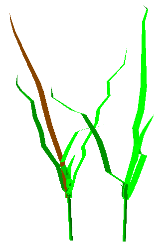
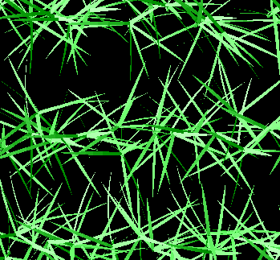

============
Plant Models
============

WeberPenn
=========

**An extension of the Weber & Penn model for OpenAlea**

.. image:: ./images/weberpenn_treegraph.png
 :width: 200px
 :target: https://openalea.readthedocs.io/en/latest/tutorials/visualea/weberpenn.html
 :align: left

**Authors** : Christophe Pradal

**Institutes** : Cirad

**Original Article** : http://citeseerx.ist.psu.edu/viewdoc/summary?doi=10.1.1.380.2046

**Source Code** : `Github <https://github.com/openalea/weberpenn>`_

|

ADEL
====

.. image:: https://readthedocs.org/projects/adel/badge/?version=latest
    :alt: Documentation status
    :target: https://adel.readthedocs.io/en/latest/?badge=latest

**OpenAlea.Adel (Architectural model of DEvelopment based on L-systems) allows to simulate the 3D architectural development of the shoot of gramineaous plant.**

**Authors** : Christian Fournier, Christophe Pradal, Bruneau Andrieu

**Institutes** :  INRAe, Cirad

**Source Code** : `Github <https://github.com/openalea/adel>`_

|
|
|
|

WheatFspm
=========

.. image:: https://readthedocs.org/projects/wheatfspm/badge/?version=latest
    :alt: Documentation status
    :target: https://wheatfspm.readthedocs.io/en/latest/?badge=latest

**WheatFspm is a Functional Structural Plant Model (FSPM) of wheat which fully integrates shoot morphogenesis and the metabolism of carbon (C) and nitrogen (N) at organ scale within a 3D representation of plant architecture.**

**Authors** : Romain BARILLOT, Marion GAUTHIER, Camille CHAMBON, Bruno ANDRIEU

**Institutes** :  INRAe

**Source Code** : `Github <https://github.com/openalea/wheatfspm>`_

|