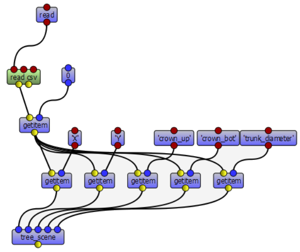
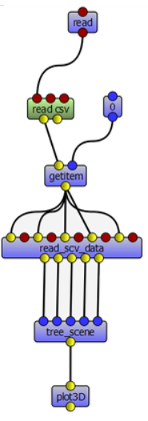
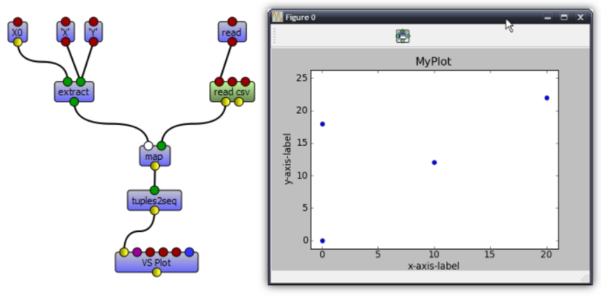

==========================
Using Visualea : Beginning
==========================

Here is a tutorial in which you will see how to implement a simple modeling problem in *Visualea*

.. image:: ./images/beginner/intro.gif

Here is what you need for the following tutorial
::
    conda create -n visualea_tuto -c openalea openalea.visualea openalea.components openalea.plantgl boost=1.66 -c openalea/label/unstable
    conda activate visualea_tuto

Once you installed and activated the OpenAlea environment (see `Installation <https://openaleadocs.readthedocs.io/en/latest/install.html>`_), execute this 
::

    visualea

The Goal
========

We measured some tree data and saved these in a tabbed editor (like Excel). The data has been exported in a CSV file. We want to have a simple 3D representation  of the measured tree.

Here is the data :

.. csv-table::
   :header: "X", "Y", "crown_up", "crown_bot", "trunk_diameter"
   :widths: 15, 15, 20, 20, 20

   0, 0, 10, 20, 2
   10, 12, 12, 18, 3
   20, 22, 8, 23, 3.4
   0, 18, 14, 22, 2.5

You may want to download the `CSV file <https://github.com/openalea/openalea.rtfd.io/blob/master/doc/_static/stand.csv>`_.

Step 1 : Create Your Own Package
================================

First of all, we need to create a package where to put your work (dataflow, node definition, data, …). A package is in fact a simple directory containing python files.

Create a package
----------------

#. Select **Package Manager** -> **Add** -> **Package**
#. Fill the form : 
   
   * **Name** : standbuilder
   * **Description** : build stand representation from measured data
   * **Version** : 0.1
   * **License** : Cecill-C
   * **Authors** : All collaborators and package writer
   * **Institutes** : …
   * **URL** : …
   * **Path** : /home/myhome/openalea_pkg (could be anywhere you want)

#. Click "OK"

.. image:: ./images/beginner/step1.gif

Your new package should appear in the package manager.

.. tip::
   The path corresponds to the directory where the python file will be written. 
   Choose it carefully in order to be able to find it later.

Step 2 : Read CSV Data
======================

Create a dataflow to read and view a file
-----------------------------------------

.. tip::
   Leaving the cursor on any item in the Package Manager, or on nodes or ports in 
   the dataflow view brings up a tooltip. Clicking on them also shows some documentation 
   in the "Help" tab (bottom-left-hand corner).

#. In the Package Manager tab (left column), open the *openalea.file* folder. You should 
   see a list of nodes.
   
   .. note::
      You can search for a particuliar node in the Search tab.

#. In the Package Manager tab, drag the ``read`` node from the *openalea.file* package to the 
   workspace. It should now appear on the canvas.
#. In the workspace, right click on the ``read`` node and choose "Open Widget". 
   Then browse for the "stand.csv" file (no need to validate anything, 
   changes are automatically taken into account so you can simply close the window).
#. In the package manager search the ``text`` in the **search tab**, then drag the ``text`` node from the *openalea.data structure.string* folder onto the workspace.
#. Connect the output of the ``read`` node to the input of the ``text`` node.

.. image:: ./images/beginner/step2.1.gif

View the file contents
----------------------

#. Right click on the ``text`` node and select "Run"
#. Right click on the ``text`` node and select "Open Widget"

Build a CSV object
------------------

In order to manipulate the CSV data, we are going to build a CSV object.

#. Select the search tab in the package manager
#. Type CSV
#. Drag the ``read csv`` node on the workspace
#. Do the same to create a ``getitem`` node (``openalea.python method.getitem``)
#. Connect ``read``'s output to ``read csv``'s input
#. Connect ``read csv``'s first output to ``getitem``'s first input
#. Add an ``int`` node on the workspace, and connect its output to the second input of ``getitem``
#. Execute the graph by selecting "Run" in the context menu of the ``getitem`` node
#. Print the output in the shell : Right click on the output port, and select "Print" 

.. image:: ./images/beginner/step2.2.gif

Save your work
--------------

#. Select **File** -> **Save as composite node** (CTRL + S)
#. In the selector dialog, click "New" Button
#. In the new dialog
   
   * Select the standbuilder package in the combo box
   * Enter the name : *readcsv_1*
   * Add a description : *Read data file* 
   * Click "Ok"

#. In the selector, click "Ok" button
#. The new graph should appear in the standbuilder package.

.. image:: ./images/beginner/step2.3.gif

Step 3 : Create a simple 3D representation of one tree
======================================================

Before displaying the whole stand, we must rebuild a tree. 
In this tutorial we build a very simple tree representation composed by a 
sphere for the crown and a cylinder for the trunk.

Create a 3D object
------------------

This simple dataflow shows how to display a scene object.

#. First step, we create a new workspace : Select **File** -> **New Empty Workspace** (CTRL+T)
#. Create the following dataflow by using PlantGL nodes

   * ``plantgl.objects.cylinder`` creates a cylinder
   * ``plantgl.objects.translated`` moves the input object
   * ``openalea.data structure.tuple.tuple3`` to set the translation vector
   * ``plantgl.visualization.plot3d`` to view the result
   * ``openalea.data structure.float`` to set the parameters of the tuple3 node

.. image:: ./images/beginner/step3.1.PNG

Create a simple tree
--------------------

To build our tree, we must construct a PlantGL scene containing a cylinder and a sphere.

#. Modify the previous dataflow as follow:

   * Add a ``plantgl.objects.sphere`` object
   * Add a ``plantgl.objects.translated`` object
   * Add a ``plantgl.objects.scene`` object
   * Connect the 2 translated objects to a ``plantgl.objects.scene`` object

#. Save this dataflow in your standbuilder package as **simple_tree**

.. image:: ./images/beginner/step3.2.PNG

Step 4 : Create a Macro Node / Group Nodes
==========================================

We will need to use the previous dataflow to build trees. 
To simplify this procedure, we would like to use a simple node and not a complex dataflow. 
For that we are going to embed the previous dataflow in a *composite node* (also named *macro node*).

Transform simple_tree to a reusable composite node
--------------------------------------------------

#. Select **simple_tree** in the package manager
#. Right click on the **simple_tree** graph, select "Properties" and click on the "Inputs / Outputs" 
   button 
#. Add 5 inputs with the + button :

   * X - IInt - 0 - X position
   * Y - IInt - 0 - Y position
   * crown_up - IFloat - 16.0 - Top of the crown
   * crown_bot - IFloat - 8.0 - Bottom of the crown
   * trunk_dia - IFloat - 3.0 - Trunk diameter

#. Add 1 output with the + button
 
   * scene - None - PlanGL scene
   
   .. image:: ./images/beginner/step4.1.PNG
      :width: 40%

#. Click "OK" and the buttons will appear in the workspace

#. Double click **simple_tree** and modify the graph as follow

   * Connect input 0 and 1 to the X and Y nodes
   * Connect input 2 and 3 to a minus node ``openalea.math.-``, and connect the result 
     to the crown radius
   * Connect input 5 to the trunk radius
   * Connect input 3 to the crown bottom

#. Save your work as a new composite node in standbuilder named **tree_scene**

.. image:: ./images/beginner/step4.2.PNG
   :width: 70%

Using the new composite node in a dataflow
------------------------------------------

#. Open our first dataflow **readcsv_1** in the standbuilder package (doubleclick)
#. Drag the node ``standbuilder.tree_scene`` on the new workspace
#. Add 5x ``getitem`` and 5x ``string`` object
#. Connect the nodes as the picture in order to retrieve to different object properties
#. Add a ``plangl.visualization.plot3D`` object and connect it to the output of ``tree_scene``
#. Run the dataflow several times and change the value of the first ``getitem`` (object index)
#. Save the dataflow in the standbuilder package as **readcsv_2**

Create a composite node by grouping nodes
-----------------------------------------

#. Select the 5 ``getitem`` and their associated ``string`` object
#. Click on Menu **Workspace** -> **group** (CTRL+G)
#. Run the dataflow
#. Save it in the standbuilder package as **readcsv_3**

Step 5 : Get the spatial distribution of the trees
==================================================

We want to extract from the csv object the X and Y properties and plot them in 2D.

Extract data
------------

#. Create a new workspace (CTRL+T)
#. Add a ``read`` node and a ``read csv`` node to read a csv file
#. Set the file to read by opening the ``read`` widget (*Open Widget*)
#. Run and display the output (output port context menu -> *Print* or *Tooltip*) : it's a list of obj
#. Add a ``getitem`` node and an ``int`` node to select an object in the list
#. Add an ``extract`` node and 2 ``string`` nodes to select properties in a particular object
#. Set the 2 ``string`` objects to X and Y
#. Run and display the output (output port context menu -> *print* or *tooltip*) : it's a 
   list containing the X and the Y properties of the selected object.

.. image:: ./images/beginner/step5.1.PNG

Implement iterative process
---------------------------

We want to do the same thing, but for all the CSV objects contained in the file.

#. Remove the ``getitem`` and the ``int`` nodes (with suppr)
#. Add an ``openalea.function operator.map``
#. Connect the output of ``extract`` to the first input of ``map``
#. Connect the output of ``read csv`` to the second input of ``map``
#. Add an ``openalea.flow control.X`` node and connect its output the first input of ``extract``
#. Run the ``map`` object and display the result

.. note::

   The X object represents a function variable. The map apply a
   function to each element received in its second input.

Plot 2D
-------

#. Add the nodes ``openalea.plottools.VS Plot`` and ``openalea.plottools.tuples2seq`` on the workspace
#. Connect the ``map`` output the input of ``tuples2seq`` and the last output the ``VS Plot`` node.
#. Run the dataflow
#. Save it in the standbuilder package as **plot_csv**

Step 6 : Apply the process to multiple trees
============================================

In this step, we used the same method to build the entire stand

#. Open the ``readcsv_3`` dataflow
#. Modify it in order to plot in 3D all the tree contained in the file and not only one
#. Use a ``openalea.flow control.X`` node and a ``openalea.functional.map`` node
#. Save this work in your standbuilder package as **plot_stand**

.. image:: ./images/beginner/step6.1.PNG
   :width: 45%
.. image:: ./images/beginner/step6.2.PNG
   :width: 45%

