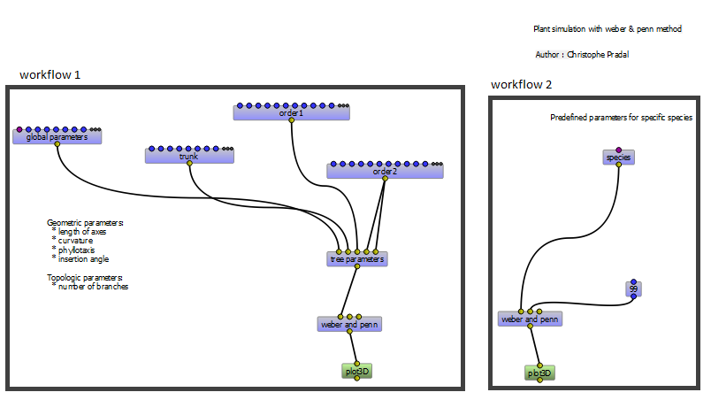
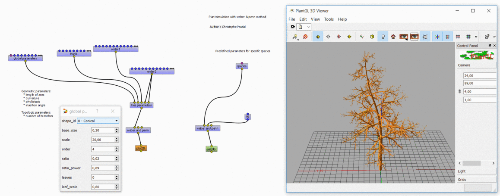

.. _OpenAlea : https://github.com/openalea

=====================================
Using Visualea : Weberpenn
=====================================

.. image:: ./images/weberpenn/intro.gif

Context
========

In OpenAlea_, different tree architectures can be generated procedurally. 
``OpenAlea.WeberPenn`` is based on the tree generating algorithm defined by Weber and Penn in 1995.

The model generates a tree structure based on a set of allometric rules.
Fundamental parameters are, for instance, the overall appearance of the tree, 
the size of the lower part of the tree without axes, the max branching order or the curvature of the axes.

Install
=========

Install Visualea and Weberpenn for this tutorial
::

    conda install -c openalea3 -c conda-forge openalea.weberpenn openalea.visualea

Then, execute this
::

    visualea

Model Parameters
================

Image Courtesy of Wolfram Diestel, developer of the `Arbaro software <http://arbaro.sourceforge.net/>`_.

* | General shape parameters : 
  | **Scale** and **ScaleV** : Global size of the tree 
  | **BaseSize** - Size of the lower part of the tree without branches 

  Each other parameters are defined for each branch level (or **order**) with order0 = trunk

  .. image:: ./images/weberpenn/weber_param_1.png

* Branch **length** is specified by the user at each order and 
  is relative to the father branch length and to the overall shape of the tree.
  
  .. image:: ./images/weberpenn/weber_param_2.png

* **rotation** (aka rotationV) define the phyllotaxis angle at each order

  .. image:: ./images/weberpenn/weber_param_3.png

* | **curve** parameter defines curvature of branches 
  | **curve back** define inflexion angle

  .. image:: ./images/weberpenn/weber_param_4.png

* **down_angle** define the angle of insertion between a branch and its father

  .. image:: ./images/weberpenn/weber_param_5.png

Begin with weberpenn
====================

Once you've launched Visualea, in the package manager, go in *demo* and **double-click** on ``demo_WeberPenn``.

.. image:: ./images/weberpenn/package_manager.png
   :width: 20%

|
| There will see two workflows in the workspace.

Workflow 1
----------

On this workflow, there are the ``global parameters``, ``trunk``, ``order 1``, ``order 2``, ``tree parameters``, 
``weber and penn`` and ``plot3D`` nodes. You can change some parameters by **double-clicking** on the nodes.

* ``Global parameters`` change main parameters of the tree like its shape 

  .. image:: ./images/weberpenn/step1_2.PNG
     :width: 20%
  |

* ``trunk``, ``order 1`` and ``order 2`` allow to change parameters of the current order

  .. image:: ./images/weberpenn/step1_3.PNG
     :width: 20%

  |

* ``tree parameters`` synthesizes all the parameters into a unique *global parameters* object
* ``weber and penn`` computes the scene with all the generated surfaces
* ``plot3D`` displays a 3D-scene

**Right-click** on the ``plot3D`` node and **click** on "Run". The scene will appear and you'll be able to see the 
tree architecture corresponding to the inputs you've entered in the parameters nodes

.. tip:: 
   You may want to change some parameters and see the impact on the tree architectures in real time. 
   To do this, **right-click** on the ``plot3D`` node and **click** on "Mark as User Application" then run the node. 
   Now, when you change a parameter, the scene updates instantly. Have fun !!!

Workflow 2
---------

On this workflow, it is the same as the `Workflow 1`_ but you only have to choose the species you want in the 
``species`` node. There are 3 species that have been preset.

.. image:: ./images/weberpenn/step1_5.gif
